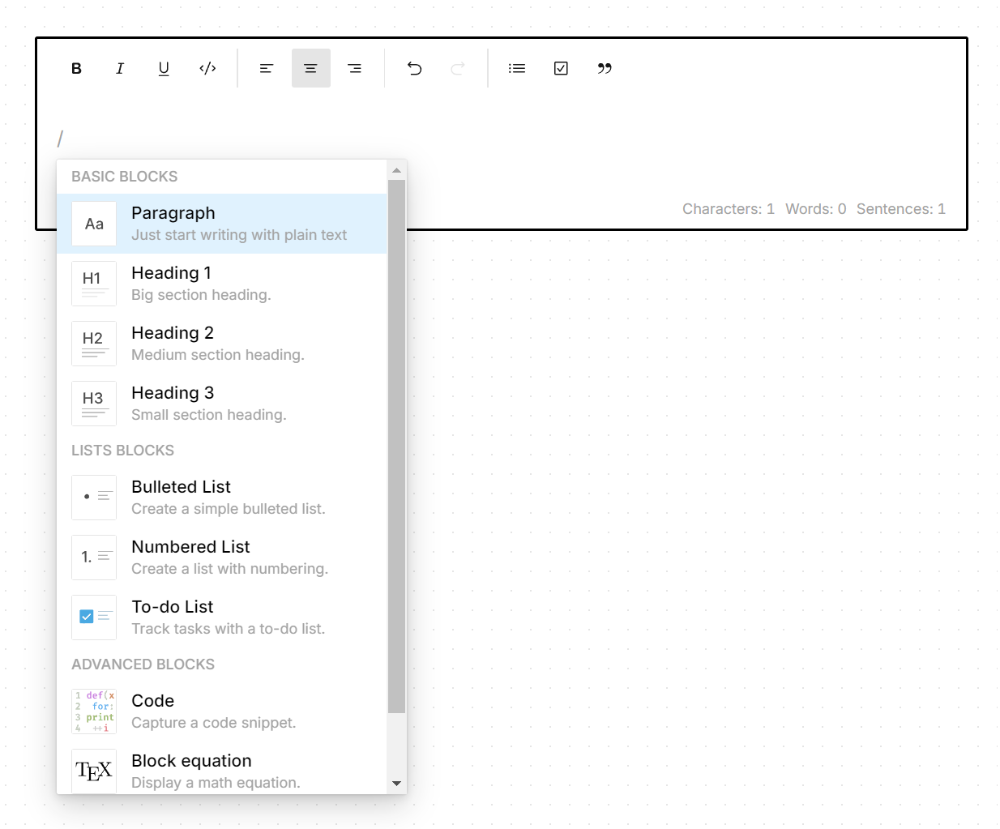

## editor

<div align="center">
	<a href="https://editor-brianhung.vercel.app/">
		
	</a>
</div>

This is a rich text editor built upon the [ProseMirror](https://prosemirror.net/) framework.
It is based off [tiptap](https://tiptap.dev/) and [rich-markdown-editor](https://github.com/outline/rich-markdown-editor), but tries to stay agnostic to Vue and React.

To see the editor in action, visit the [demo](https://editor-brianhung.vercel.app/).

**This repo is a public mirror of private development branch, and is not intended for production use.** The recommended way to use this editor is to fork this repo or use it as a reference in building your own rich text editor; consider it a more extensive version of [ProseMirror Cookbook](https://github.com/PierBover/prosemirror-cookbook). There is no substitute to learning [ProseMirror](https://prosemirror.net/docs/ref/) or for reading the docs.

### usage

To use with plain JavaScript, pass in the DOM element where you'd want to mount as `place` and an array of extensions to use.

```js
import { Editor } from '@brianhung/editor';
import { Text } from '@brianhung/editor-text';
import { Paragraph } from '@brianhung/editor-paragraph';
import { Doc } from '@brianhung/editor-doc';
import '@brianhung/editor/style/core.css';

let place = document.querySelector('#editor');
let editor = new Editor({
	place,
	extensions: [Text(), Paragraph(), Doc()],
});
```

To use with React,

```tsx
import { Editor, editorPropsToViewProps } from '@brianhung/editor';
import { Text } from '@brianhung/editor-text';
import { Paragraph } from '@brianhung/editor-paragraph';
import { Doc } from '@brianhung/editor-doc';
import { ProseMirror } from '@brianhung/editor-react';
import '@brianhung/editor/style/core.css';

export const EditorDemo = React.memo(() => {
	const [mount, setMount] = React.useState<HTMLElement | null>(null);
	const [editorState] = React.useState(
		() =>
			editorPropsToViewProps({
				content: JSON.parse(localStorage.getItem('content')),
				extensions: [Text(), Paragraph(), Doc()],
			}).state
	);
	return (
		<ProseMirror
			mount={mount}
			defaultState={editorState}
			dispatchTransaction={function dispatch(this: EditorView, tr) {
				this.updateState(this.state.apply(tr));
				localStorage.setItem('content', JSON.stringify(this.state.doc.toJSON()));
			}}
		>
			<div ref={setMount} />
		</ProseMirror>
	);
});
```

### similar libraries

- [tiptap](https://tiptap.dev/)
- [prosekit](https://github.com/ocavue/prosekit)
- [remirror](https://github.com/remirror/remirror)
- [novel](https://github.com/steven-tey/novel)
- [rich-markdown-editor](https://github.com/outline/outline/tree/main/shared/editor)
- [stacks-editor](https://github.com/StackExchange/Stacks-Editor)
- [atlaskit](https://bitbucket.org/atlassian/atlassian-frontend-mirror/src/master/editor/editor-core/)
- [milkdown](https://github.com/Milkdown/milkdown)

